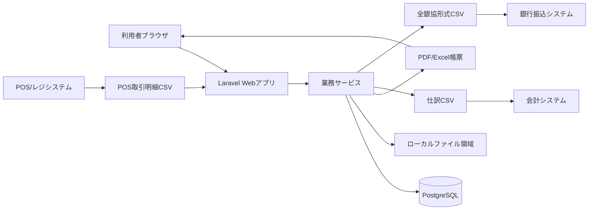
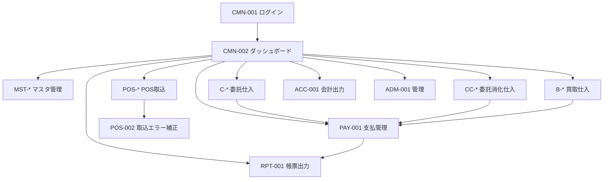
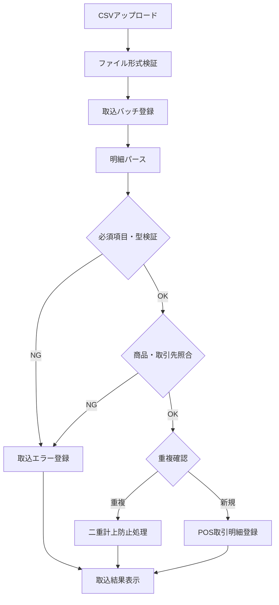
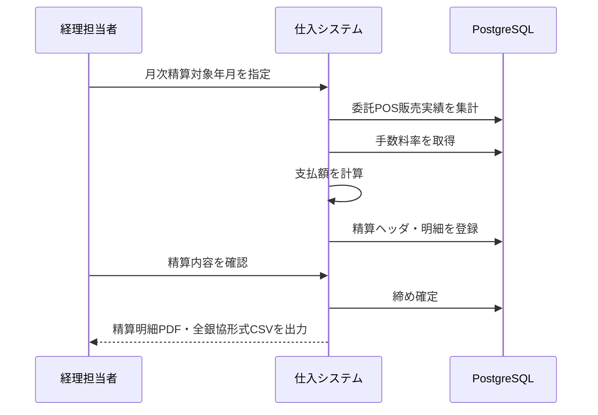
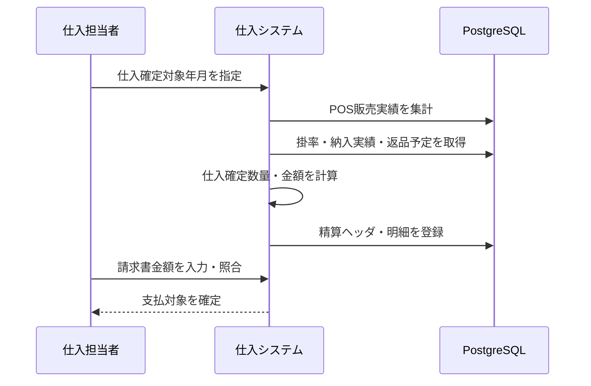
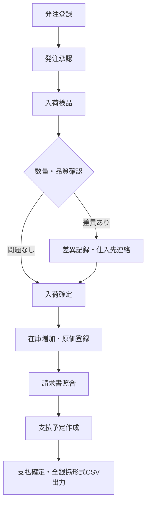

# 仕入システム 基本設計書

**プロジェクト名**: JASuppliers 仕入システム  
**対象システム**: 委託仕入システム / 委託消化仕入システム / 買取仕入システム  
**作成日**: 2026年5月14日  
**最終更新**: 2026年5月14日  
**バージョン**: 1.1  
**対象リリース**: 初期リリース

---

## 1. 文書の目的

本書は、要件定義書で定義した仕入管理業務を、Laravelアプリケーションとして実装するための基本設計を定義する。
詳細設計で作成するテーブル定義、API仕様、画面仕様、処理仕様の前提として、システム構成、機能構成、画面構成、主要データ構造、主要処理フローを明確化する。

### 1.1 参照資料

| 資料 | 場所 | バージョン |
|------|------|------------|
| 仕入システム 要件定義書 | `Docs/要件定義/仕入システム_要件定義書.md` | 1.3 |
| 仕入システム ロードマップ | `Docs/ロードマップ/仕入システム_ロードマップ.md` | 1.2 |
| ローカル実行手順書 | `Work/Readme.md` | - |
| POS取引明細サンプル | `Work/サンプルデータ/POS取引明細_サンプル.csv` | - |

### 1.2 初期リリースの設計範囲

| 区分 | 設計対象 |
|------|----------|
| 仕入形態 | 委託仕入、委託消化仕入、買取仕入の3形態すべて |
| 利用者 | 管理者、仕入担当者、店舗スタッフ、経理担当者 |
| 実行環境 | Windowsローカル環境を主対象とする |
| DB | PostgreSQLを初期標準とする |
| POS連携 | 想定CSV形式の取込を対象とする |
| 精算 | 月次精算を対象とする |
| 店舗 | 単店舗運用を対象とし、店舗コードは将来拡張用に保持する |
| Mock確認 | SeederとサンプルCSVにより、各ローカル環境で確認できる構成とする |

### 1.3 初期リリース対象外

| 項目 | 方針 |
|------|------|
| 出荷者ポータル | 後続フェーズで設計・実装する |
| Web公開・クラウド・VPS等へのデプロイ | Laravel実装後に別途検討する |
| 実POS固有仕様への完全対応 | 実データ仕様入手後に取込アダプタを追加する |
| 週次精算 | 後続フェーズで検討する |
| 複数店舗横断運用 | 初期は単店舗。データ構造上の拡張余地のみ確保する |
| モバイル専用画面 | 入荷検品・棚卸のスマートフォン/タブレット最適化は後続フェーズで検討する |
| 会計ソフト・銀行システム別の専用連携 | 会計は汎用CSV、振込は全銀協形式CSVを初期標準とし、個別システム専用アダプタは後続フェーズで検討する |

---

## 2. システム構成

### 2.1 全体構成

### 2.2 技術構成

| レイヤー | 採用方針 |
|----------|----------|
| バックエンド | PHP 8.5 / Laravel 13.x |
| フロントエンド | Laravel標準構成を前提とし、Vue.jsまたはReactは詳細設計で確定する |
| DB | PostgreSQL 18.xを初期標準とする |
| DB切替 | Laravelの `.env` / `config/database.php` により接続DBを切替可能にする |
| DB検証範囲 | 初期リリースの設計・実装・動作確認対象はPostgreSQLのみとする |
| ORM | Eloquentを標準とし、複雑な集計はQuery Builderを併用する |
| API | 画面内非同期処理・将来連携を考慮しRESTful / OpenAPI 3.0を前提とする |
| バッチ | Laravel Scheduler / Queue Jobを候補とする |
| 帳票 | PDF生成ライブラリとCSV/Excel出力を詳細設計で確定する |
| ローカル実行 | Laravel Herd + PostgreSQL Windows版を標準手順とする |
| Docker | WSL2前提のため初期確認では必須にしない |

### 2.3 アプリケーションレイヤー

| レイヤー | 役割 |
|----------|------|
| Presentation | Blade/Vue/React等による画面表示、入力、一覧、検索、帳票操作 |
| Controller | リクエスト受付、入力検証、サービス呼び出し、レスポンス制御 |
| Application Service | ユースケース単位の業務処理、トランザクション境界、外部入出力制御 |
| Domain Rule | 精算、税計算、手数料、掛率、返品、値下げ、締め後訂正などの業務ルール |
| Repository / Eloquent | DB永続化、検索条件、集計クエリ |
| Batch / Job | POS取込、販売集計、月次精算、CSV出力などの非同期・定時処理 |
| Infrastructure | ファイル入出力、帳票生成、CSV生成、監査ログ、メール等の基盤処理 |

---

## 3. 機能構成

### 3.1 機能モジュール

| モジュール | 主な責務 | 対応要件 |
|------------|----------|----------|
| 共通基盤 | 認証、権限、監査ログ、コード管理、店舗コード管理 | 3.6、4章 |
| 共通マスタ | 取引先、商品、店舗、カテゴリ、税区分、手数料率、掛率、支払条件 | 3.1、C-001、C-002、C-010、CC-001、CC-002、B-001、B-002 |
| POS連携 | POS取引明細CSV取込、取込エラー管理、販売実績ステージング | 3.2、C-004、CC-005 |
| 委託仕入 | 搬入、販売実績、廃棄・回収、委託精算、精算明細、振込データ | C-001〜C-008、C-010 |
| 委託消化仕入 | 納入、委託在庫、消化率、仕入確定、返品、請求照合、支払 | CC-001〜CC-011 |
| 買取仕入 | 発注、入荷、原価、在庫、返品・値引、請求照合、支払、棚卸、分析 | B-001〜B-012 |
| 精算・支払 | 月次締め、支払予定、支払明細、全銀協形式CSV | C-006、C-008、CC-010、B-009 |
| 帳票・会計連携 | PDF/Excel帳票、仕訳CSV、全銀協形式CSV | 3.4、3.5 |

### 3.2 機能ID対応

#### 委託仕入

| 機能ID | 機能名 | 初期リリース |
|--------|--------|--------------|
| C-001 | 出荷者登録 | 対象 |
| C-002 | 商品登録・バーコード発行 | 対象 |
| C-003 | 搬入受付 | 対象 |
| C-004 | 販売実績取込 | 対象 |
| C-005 | 廃棄・回収管理 | 対象 |
| C-006 | 委託精算計算 | 対象 |
| C-007 | 精算明細書発行 | 対象 |
| C-008 | 振込データ作成 | 対象 |
| C-009 | 出荷者ポータル | 後続フェーズ |
| C-010 | 手数料マスタ管理 | 対象 |

#### 委託消化仕入

| 機能ID | 機能名 | 初期リリース |
|--------|--------|--------------|
| CC-001 | 仕入先マスタ管理 | 対象 |
| CC-002 | 商品マスタ管理 | 対象 |
| CC-003 | 納入受付 | 対象 |
| CC-004 | 委託在庫管理 | 対象 |
| CC-005 | 販売実績取込 | 対象 |
| CC-006 | 消化率管理 | 対象 |
| CC-007 | 仕入確定処理 | 対象 |
| CC-008 | 返品処理 | 対象 |
| CC-009 | 請求照合 | 対象 |
| CC-010 | 支払管理 | 対象 |
| CC-011 | 消化レポート | 対象 |

#### 買取仕入

| 機能ID | 機能名 | 初期リリース |
|--------|--------|--------------|
| B-001 | 仕入先マスタ管理 | 対象 |
| B-002 | 商品マスタ管理 | 対象 |
| B-003 | 発注管理 | 対象 |
| B-004 | 入荷管理 | 対象 |
| B-005 | 仕入原価管理 | 対象 |
| B-006 | 在庫管理 | 対象 |
| B-007 | 返品・値引処理 | 対象 |
| B-008 | 請求書照合 | 対象 |
| B-009 | 支払管理 | 対象 |
| B-010 | 発注点管理 | 対象 |
| B-011 | 在庫棚卸 | 対象 |
| B-012 | 仕入分析 | 対象 |

---

## 4. 画面構成

### 4.1 画面一覧

| 画面ID | 画面名 | 主な機能 | 対応要件 |
|--------|--------|----------|----------|
| CMN-001 | ログイン | 認証、ログアウト | 3.6 |
| CMN-002 | ダッシュボード | 当日取込状況、未処理件数、締め状況の表示 | 共通 |
| MST-001 | 取引先一覧・登録 | 出荷者、仕入先、サプライヤー、口座情報の管理 | C-001、CC-001、B-001 |
| MST-002 | 商品一覧・登録 | 商品、税区分、仕入形態、バーコードの管理 | C-002、CC-002、B-002 |
| MST-003 | 店舗・カテゴリ・税区分管理 | 店舗コード、部門、カテゴリ、税率の管理 | 3.1、3.3 |
| MST-004 | 手数料・掛率・支払条件管理 | 委託手数料率、消化掛率、支払条件の管理 | 3.1、C-010、CC-002、B-009 |
| POS-001 | POS取込 | CSVアップロード、取込実行、取込履歴表示 | 3.2、C-004、CC-005 |
| POS-002 | POS取込エラー補正 | 未照合データの確認、商品・取引先紐付け、再取込 | 3.2 |
| C-001-S | 委託搬入受付 | 搬入数量、価格、出荷者、商品情報の登録 | C-003 |
| C-002-S | 委託廃棄・回収 | 廃棄、回収、返品、値下げの登録 | C-005 |
| C-003-S | 委託精算 | 月次精算計算、精算確認、締め処理 | C-006 |
| C-004-S | 委託精算明細 | 精算明細PDF、印刷、再発行 | C-007 |
| CC-001-S | 委託消化納入受付 | 納入数量、ロット、商品情報の登録 | CC-003 |
| CC-002-S | 委託在庫 | 委託在庫、販売数、返品予定数の確認 | CC-004、CC-006 |
| CC-003-S | 仕入確定 | 販売実績に基づく仕入確定、月次締め | CC-007 |
| CC-004-S | 委託消化返品 | 未販売在庫の返品処理 | CC-008 |
| CC-005-S | 委託消化請求照合 | 請求書金額と仕入確定金額の照合 | CC-009 |
| CC-006-S | 消化レポート | 仕入先別、商品別の消化率・在庫推移 | CC-011 |
| B-001-S | 発注管理 | 発注作成、承認、発注書出力 | B-003、B-010 |
| B-002-S | 入荷管理 | 入荷検品、入荷数量、原価登録 | B-004、B-005 |
| B-003-S | 買取在庫 | 商品別・保管場所別在庫、在庫金額 | B-006 |
| B-004-S | 返品・値引 | 品質不良、過剰仕入、値引処理 | B-007 |
| B-005-S | 請求照合 | 入荷実績と請求書の照合 | B-008 |
| B-006-S | 棚卸 | 実棚数入力、差異確認、棚卸確定 | B-011 |
| B-007-S | 仕入分析 | 仕入先別、商品別、期間別の分析 | B-012 |
| PAY-001 | 支払管理 | 支払予定、支払確定、全銀協形式CSV出力 | C-008、CC-010、B-009 |
| ACC-001 | 会計出力 | 仕訳CSV、勘定科目マッピング、出力履歴 | 3.5 |
| RPT-001 | 帳票出力 | 各種PDF、Excel、CSVの出力 | 3.4、3.5 |
| ADM-001 | ユーザー・ロール管理 | ユーザー、ロール、権限設定 | 3.6 |
| AUD-001 | 監査ログ | 操作ログ検索、閲覧、出力 | 3.6 |

### 4.2 画面遷移方針

---

## 5. データ設計方針

### 5.1 共通方針

- テーブルは第3正規形以上を基本とする。
- 全テーブルに `created_at`、`updated_at`、`created_by`、`updated_by` を設ける。
- 業務マスタ・取引データには論理削除用の `deleted_at` を設ける。監査ログ、取込履歴、出力履歴など追記型で削除を許可しないテーブルは、詳細設計で削除不可理由を明記する。
- 外部キー制約を定義する。
- PostgreSQLを初期標準としつつ、Laravel Migration / Query Builder / EloquentでDB切替余地を確保する。
- 金額は日本円の1円単位で保持する。
- POS取込・精算・仕入確定の基準金額は税込金額とする。
- 返品は数量・金額を負数で保持し、元取引IDと紐付ける。
- 締め後の訂正は既存データの直接上書きではなく、訂正取引または翌月調整として扱う。
- 口座情報、個人情報、機密性の高い連絡先情報は暗号化保存の対象とする。

### 5.2 主要テーブル一覧

| 区分 | テーブル名 | 概要 |
|------|------------|------|
| 認証・権限 | `users` | 利用者 |
| 認証・権限 | `roles` | ロール |
| 認証・権限 | `permissions` | 権限 |
| 認証・権限 | `user_roles` | 利用者ロール関連 |
| 共通 | `stores` | 店舗。初期は単店舗だが店舗コードを保持 |
| 共通 | `business_partners` | 出荷者、仕入先、サプライヤー等の取引先 |
| 共通 | `business_partner_types` | 取引先種別 |
| 共通 | `partner_bank_accounts` | 取引先の振込口座 |
| 共通 | `products` | 商品 |
| 共通 | `product_barcodes` | JAN・独自バーコード |
| 共通 | `categories` | 部門・カテゴリ |
| 共通 | `tax_categories` | 税区分、税率 |
| 共通 | `commission_rates` | 委託手数料率 |
| 共通 | `consumption_rate_rules` | 委託消化の掛率 |
| 共通 | `payment_terms` | 支払条件 |
| 共通 | `business_calendars` | 締め日・支払日・休業日 |
| 共通 | `account_mapping_rules` | 仕入形態・商品カテゴリ別の勘定科目マッピング |
| POS | `pos_import_batches` | POS取込単位 |
| POS | `pos_sales_lines` | POS取引明細ステージング |
| POS | `pos_import_errors` | 取込エラー、未照合データ |
| 委託 | `consignment_receipts` | 委託搬入ヘッダ |
| 委託 | `consignment_receipt_lines` | 委託搬入明細 |
| 委託 | `consignment_disposals` | 廃棄・回収・返品記録 |
| 委託消化 | `consumption_deliveries` | 委託消化納入ヘッダ |
| 委託消化 | `consumption_delivery_lines` | 委託消化納入明細 |
| 委託消化 | `consumption_inventory_balances` | 委託消化在庫残高 |
| 委託消化 | `consumption_returns` | 委託消化返品ヘッダ |
| 委託消化 | `consumption_return_lines` | 委託消化返品明細 |
| 買取 | `purchase_orders` | 発注ヘッダ |
| 買取 | `purchase_order_lines` | 発注明細 |
| 買取 | `purchase_order_approvals` | 発注承認履歴 |
| 買取 | `purchase_receipts` | 入荷ヘッダ |
| 買取 | `purchase_receipt_lines` | 入荷明細 |
| 買取 | `purchase_price_histories` | 仕入価格の履歴・有効日管理 |
| 買取 | `reorder_point_rules` | 発注点・安全在庫ルール |
| 在庫 | `inventory_stocks` | 自社在庫残高 |
| 在庫 | `inventory_movements` | 在庫移動、入出庫、調整履歴 |
| 在庫 | `product_lots` | ロット番号、消費期限、産地等のトレーサビリティ情報 |
| 在庫 | `inventory_counts` | 棚卸ヘッダ |
| 在庫 | `inventory_count_lines` | 棚卸明細 |
| 精算・支払 | `settlements` | 精算ヘッダ |
| 精算・支払 | `settlement_lines` | 精算明細 |
| 精算・支払 | `payment_batches` | 支払処理単位 |
| 精算・支払 | `payment_lines` | 支払明細 |
| 請求照合 | `supplier_invoices` | 仕入先請求書 |
| 請求照合 | `invoice_reconciliation_lines` | 請求書と納入・入荷・仕入確定の照合明細 |
| 外部出力 | `accounting_exports` | 仕訳CSV出力履歴 |
| 外部出力 | `bank_transfer_exports` | 全銀協形式CSV出力履歴 |
| ファイル | `document_files` | 帳票、取込ファイル、出力ファイル管理 |
| 監査 | `audit_logs` | 操作ログ |

### 5.3 ER概要

```mermaid
erDiagram
    stores ||--o{ pos_import_batches : imports
    stores ||--o{ pos_sales_lines : has
    business_partner_types ||--o{ business_partners : classifies
    business_partners ||--o{ partner_bank_accounts : has
    business_partners ||--o{ products : supplies
    categories ||--o{ products : categorizes
    tax_categories ||--o{ products : applies
    categories ||--o{ account_mapping_rules : maps
    products ||--o{ product_barcodes : has
    products ||--o{ pos_sales_lines : sold_as

    pos_import_batches ||--o{ pos_sales_lines : contains
    pos_import_batches ||--o{ pos_import_errors : has

    business_partners ||--o{ consignment_receipts : consigns
    consignment_receipts ||--o{ consignment_receipt_lines : contains
    products ||--o{ consignment_receipt_lines : received
    products ||--o{ consignment_disposals : disposed

    business_partners ||--o{ consumption_deliveries : delivers
    consumption_deliveries ||--o{ consumption_delivery_lines : contains
    products ||--o{ consumption_delivery_lines : delivered
    products ||--o{ consumption_inventory_balances : balances
    consumption_returns ||--o{ consumption_return_lines : contains

    business_partners ||--o{ purchase_orders : receives_order
    purchase_orders ||--o{ purchase_order_lines : contains
    purchase_orders ||--o{ purchase_order_approvals : approved_by
    purchase_orders ||--o{ purchase_receipts : received_by
    purchase_receipts ||--o{ purchase_receipt_lines : contains
    products ||--o{ purchase_order_lines : ordered
    products ||--o{ purchase_receipt_lines : received
    products ||--o{ purchase_price_histories : priced
    products ||--o{ reorder_point_rules : replenished_by

    products ||--o{ inventory_stocks : stocked
    products ||--o{ product_lots : traced_by
    product_lots ||--o{ inventory_movements : moves
    inventory_stocks ||--o{ inventory_movements : moves
    inventory_counts ||--o{ inventory_count_lines : contains

    business_partners ||--o{ settlements : settled
    settlements ||--o{ settlement_lines : contains
    payment_batches ||--o{ payment_lines : contains
    settlements ||--o{ payment_lines : paid_by
    business_partners ||--o{ supplier_invoices : bills
    supplier_invoices ||--o{ invoice_reconciliation_lines : reconciles
```

---

## 6. 主要業務処理設計

### 6.1 POS取込処理

| 項目 | 設計 |
|------|------|
| 取込方式 | CSVファイルアップロードを基本とする |
| 文字コード | UTF-8 |
| 一意キー | `pos_transaction_id` + `line_no` |
| 対象データ | 販売、返品、値下げ販売 |
| 取込単位 | 営業日単位または任意ファイル単位 |
| 重複処理 | 一意キーが既存の場合は更新扱いとし、二重計上を防止する。締め済み期間の再取込はエラーまたは訂正取引として扱う |
| エラー処理 | 商品・取引先・バーコード未照合は取込エラーとして保持し、補正後に再処理する |

### 6.2 委託仕入の月次精算

| 項目 | 設計 |
|------|------|
| 精算対象 | 委託商品の月次販売実績 |
| 精算単位 | 出荷者、店舗、対象年月 |
| 計算式 | 販売税込金額 - 手数料 = 支払額 |
| 除外対象 | 廃棄、回収、返品等で精算対象外となる明細 |
| 締め後訂正 | 訂正取引または翌月調整として扱う |
| 出力 | 精算明細PDF、全銀協形式CSV |

### 6.3 委託消化仕入の仕入確定

| 項目 | 設計 |
|------|------|
| 仕入確定対象 | 委託消化商品の販売実績 |
| 確定単位 | 仕入先、商品、対象年月 |
| 計算式 | 販売確定数量 × 仕入掛率 = 仕入金額 |
| 未販売在庫 | 仕入未確定在庫として管理し、返品処理対象とする |
| 請求照合 | 仕入確定金額と請求書金額を照合する |
| 出力 | 消化精算書、支払明細、全銀協形式CSV |

### 6.4 買取仕入の入荷から支払

| 項目 | 設計 |
|------|------|
| 仕入開始 | 発注登録または直接入荷登録 |
| 所有権 | 入荷確定時点で店舗へ移転する |
| 在庫 | 入荷確定で自社在庫を増加させ、販売・返品・棚卸で減少または調整する |
| 原価 | 仕入単価を保持し、在庫金額・仕入分析に利用する |
| 請求照合 | 入荷実績と請求書を照合する |
| 支払 | 支払条件に基づき支払予定を作成する |

---

## 7. 金額・税・締め設計

| 項目 | 基本設計 |
|------|----------|
| 通貨 | 日本円 |
| 金額単位 | 1円単位 |
| 基準金額 | POS取込、精算、仕入確定は税込金額を基準とする |
| 消費税 | 軽減税率8%、標準税率10%を税区分として管理する |
| 税額端数 | 税込金額から税額を算出する場合は1円未満を四捨五入する |
| 手数料・掛率端数 | 1円未満を四捨五入する |
| 返品 | 数量・金額を負数で保持し、元取引IDを保持する |
| 値下げ | 値下げ額と値下げ後税込金額を保持し、精算・仕入確定の基準とする |
| 締め処理 | 月次締めを標準とし、締め後訂正は訂正取引または翌月調整で扱う |

---

## 8. 帳票・外部出力設計

### 8.1 帳票

| 帳票名 | 形式 | 主な対象 |
|--------|------|----------|
| 委託精算明細書 | PDF / 印刷 | 出荷者 |
| 消化精算書 | PDF / 印刷 | 委託消化仕入先 |
| 仕入明細書 | PDF / 印刷 | 経理担当者 |
| 振込依頼書 | 全銀協形式CSV | 銀行振込 |
| 在庫一覧表 | Excel / PDF | 店舗スタッフ、仕入担当者 |
| 仕入先別取引実績 | Excel / PDF | 経理担当者、管理者 |
| 棚卸差異報告書 | PDF | 店舗スタッフ、管理者 |

### 8.2 外部出力

| 出力 | 形式 | 方針 |
|------|------|------|
| 仕訳データ | 汎用CSV | 初期は会計ソフト非依存の形式で出力する |
| 振込依頼データ | 全銀協形式CSV | 初期標準は全銀協形式とし、Mock確認用に汎用CSV出力も補助的に扱える設計とする |
| POS取込結果 | CSV / 画面表示 | 取込件数、エラー件数、警告件数を確認できるようにする |

---

## 9. バッチ・ジョブ設計

| ジョブID | ジョブ名 | 実行方式 | 概要 |
|----------|----------|----------|------|
| POS_IMPORT | POS取込 | 手動実行 / 将来定時化 | CSVを取り込み、POS取引明細へ登録する |
| SALES_AGGREGATION | 販売集計 | 手動実行 / 将来定時化 | POS取引明細を仕入形態別に集計する |
| CONSIGNMENT_SETTLEMENT | 委託月次精算 | 手動実行 | 委託販売実績から精算明細を作成する |
| CONSUMPTION_PURCHASE_CONFIRM | 委託消化仕入確定 | 手動実行 | 販売実績から仕入確定金額を作成する |
| PAYMENT_EXPORT | 支払・全銀協形式CSV出力 | 手動実行 | 支払確定データから全銀協形式CSVを出力する |
| ACCOUNTING_EXPORT | 仕訳CSV出力 | 手動実行 | 仕入、精算、支払、在庫調整の仕訳CSVを出力する |
| AUDIT_LOG_ARCHIVE | 監査ログ保全 | 定時実行候補 | 監査ログの保管・検索性能維持を行う |

---

## 10. 権限設計

### 10.1 ロール

| ロール | 主な権限 |
|--------|----------|
| 管理者 | 全機能、ユーザー・ロール管理、マスタ管理 |
| 仕入担当者 | 取引先・商品管理、発注、入荷、納入、仕入確定 |
| 店舗スタッフ | 搬入受付、入荷検品、在庫、廃棄・回収、棚卸 |
| 経理担当者 | 精算、請求照合、支払、帳票、会計CSV・全銀協形式CSV出力 |

### 10.2 監査ログ対象

画面操作、バッチ実行、外部入出力は原則として監査ログに記録する。以下は重点的に詳細を保持する操作である。

| 操作 | 記録内容 |
|------|----------|
| ログイン・ログアウト | 利用者、日時、IPアドレス |
| マスタ登録・更新・削除 | 対象テーブル、対象ID、変更前後概要 |
| POS取込 | 取込ファイル、件数、エラー件数、実行者 |
| 精算・仕入確定 | 対象年月、対象取引先、金額、実行者 |
| 支払確定・CSV出力 | 支払バッチ、出力件数、出力者 |
| 締め解除・再計算 | 理由、承認者、実行者 |

---

## 11. 非機能設計

| 項目 | 基本設計 |
|------|----------|
| 性能 | 通常画面操作は3秒以内の応答を目標とする |
| バッチ処理 | 日次POS取込・販売集計は深夜時間帯で完了できる設計とする |
| 同時利用 | 20ユーザー程度の同時利用を前提とする |
| データ保持 | 取引データは10年分を検索可能に保持する |
| 監査ログ | 7年間保管する |
| 可用性 | 店舗営業時間中の利用を前提とし、メンテナンス時間を設定できるようにする |
| 稼働率 | 店舗営業時間（7:00〜21:00）に99%以上の稼働率を目標とする |
| RTO | 障害発生から4時間以内の復旧を目標とする |
| RPO | 最大1日分のデータ損失を許容範囲とする |
| バックアップ | PostgreSQLの日次バックアップと30日間の世代管理を前提とし、復旧手順を実装フェーズで手順化する |
| セキュリティ | パスワード認証、ロールベースアクセス制御、操作ログを実装する |
| データ暗号化 | 口座情報、個人情報、接続情報は暗号化保存またはGit管理対象外とする |
| 機密情報 | `.env`、DBダンプ、APIキー、個人情報をGit管理しない |
| API連携 | 将来のPOS・会計連携に備え、RESTful / OpenAPI 3.0で仕様化できる構成にする |
| モバイル対応 | 初期はPCブラウザを標準とし、入荷検品・棚卸のモバイル最適化は後続フェーズで検討する |
| ローカル確認 | WindowsローカルでSeederとサンプルCSVによりMock確認できるようにする |

---

## 12. 詳細設計で定義する事項

本書ではシステム全体の基本構造を定義し、以下は詳細設計で確定する。

| 詳細設計対象 | 主な定義内容 |
|--------------|--------------|
| 共通マスタ詳細設計 | テーブル定義、入力項目、バリデーション、マスタ初期値 |
| POS連携詳細設計 | CSVレイアウト、取込エラー、重複判定、再取込仕様 |
| 委託仕入詳細設計 | 搬入、廃棄、精算、帳票、振込データの処理仕様 |
| 委託消化仕入詳細設計 | 納入、在庫、消化率、仕入確定、返品、請求照合の処理仕様 |
| 買取仕入詳細設計 | 発注、入荷、原価、在庫、棚卸、支払の処理仕様 |
| 請求照合詳細設計 | 仕入先請求書、照合明細、差異処理、承認の処理仕様 |
| 帳票・CSV詳細設計 | PDF、Excel、仕訳CSV、全銀協形式CSVの項目定義 |
| 認証・権限詳細設計 | ロール、権限、画面別アクセス制御 |
| バッチ詳細設計 | ジョブ引数、実行タイミング、リトライ、エラー通知 |

---

## 13. 要件トレーサビリティ

| 要件領域 | 本書の対応章 |
|----------|--------------|
| プロジェクト概要・リリース方針 | 1章、2章 |
| 委託仕入 | 3章、4章、5章、6.2 |
| 委託消化仕入 | 3章、4章、5章、6.3 |
| 買取仕入 | 3章、4章、5章、6.4 |
| 共通マスタ | 3章、4章、5章 |
| POS連携 | 2章、3章、4章、6.1 |
| 金額・税・締め処理 | 7章 |
| 帳票出力 | 8章 |
| 会計連携 | 8章、9章 |
| セキュリティ | 10章、11章 |
| 非機能要件 | 11章 |
| 初期対象外・後続フェーズ | 1.3、12章 |

---

## 14. レビュー履歴

| 日付 | バージョン | 内容 |
|------|------------|------|
| 2026年5月14日 | 1.1 | 要件定義・ロードマップとの再レビューを実施。POS再取込、請求照合、価格履歴、発注点、ロット管理、勘定科目マッピング、全銀協形式CSV、非機能要件の不足を補正 |

---

*作成: JASuppliers プロジェクト*
